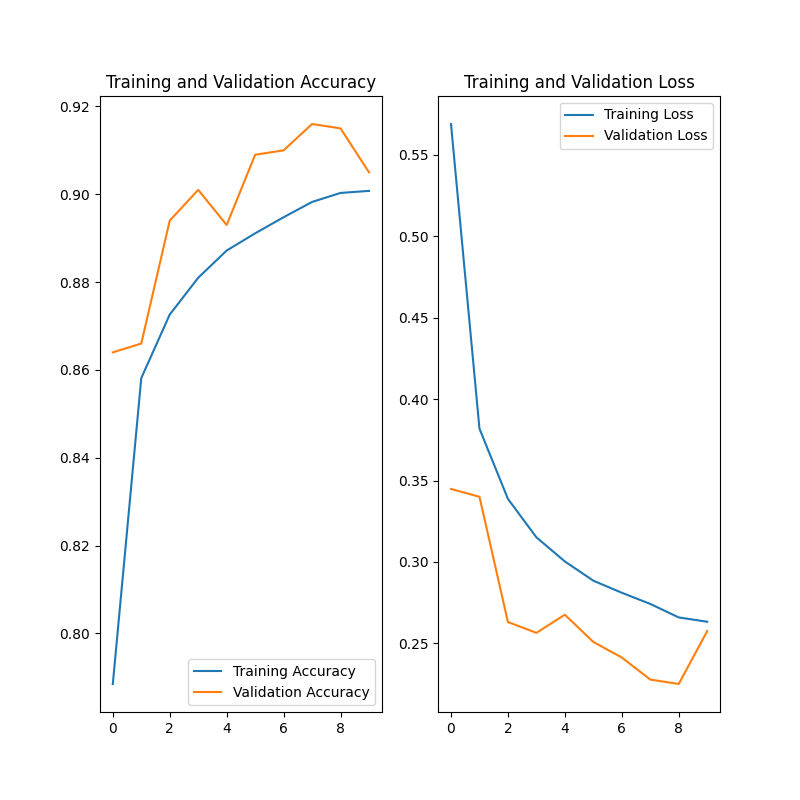
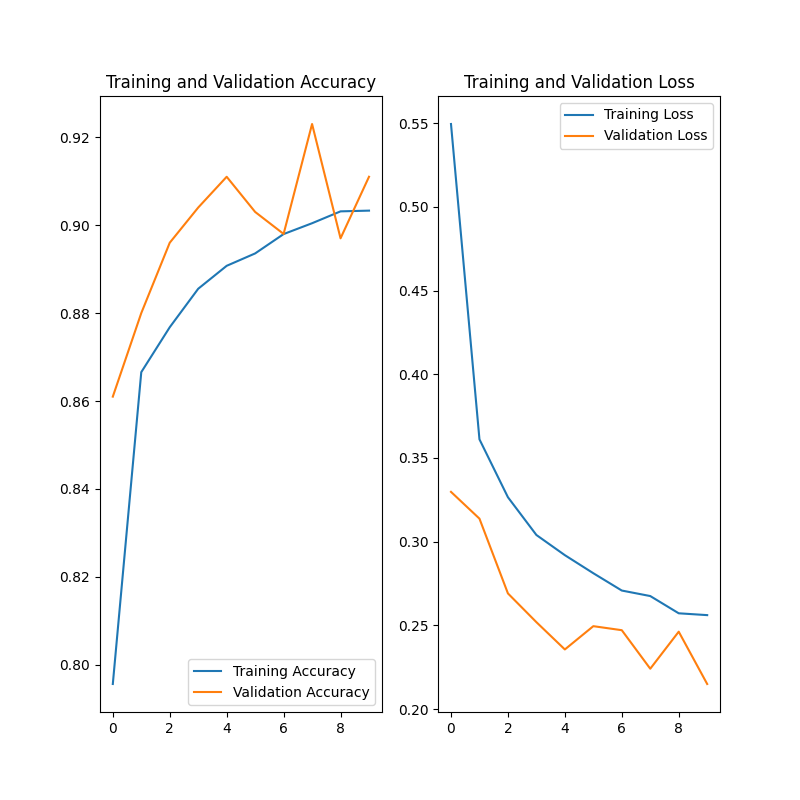
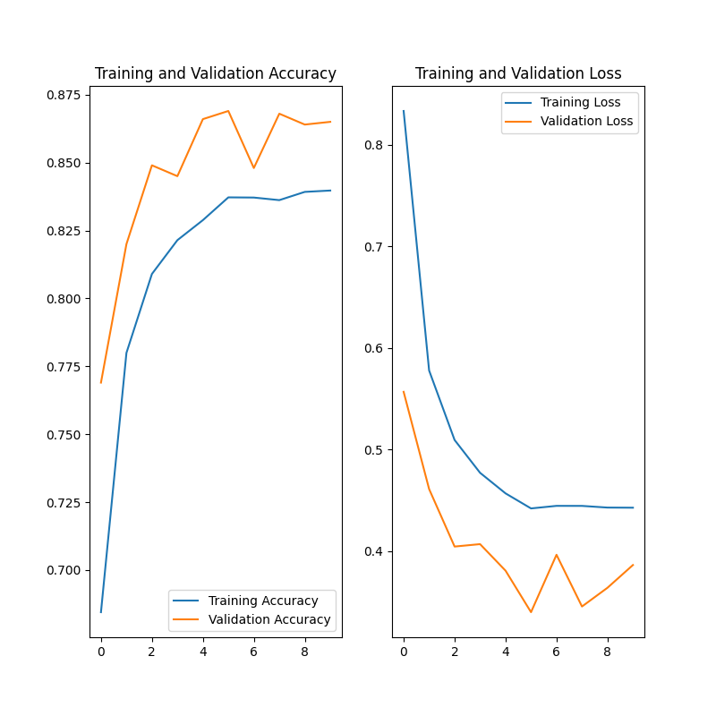

## MiniConvNet - A Fashion MNIST [1] Classifier

### Ideas
A first thought was to try out a simple fully connected two-layer network.
The first layer flattens the input image and connects it to a dense fully connected 256 neurons layer.
Which then is connected to a fully connected 10 output layer.

After some experiments this network was clearly showing signs of overfitting and was not robust.
So, I tried a more sophisticated way.
The main structure is following AlexNet's [2] proposal.
The "MiniConvNet" network consists of three blocks, where the last two block are composed of two successive convolutions.
The convolution layers are initialized with random noise, to give the optimizer a better start.
A dropout layer is added after every block to counteract overfitting.
Additionally, I investigated the use of data augmentation and different optimizers.
The results are compared in the table below.

### Experiments
The fully connected network reached a training accuracy of ~80% and testing accuracy of less than 50% after 10 epochs.
Clearly showing the signs of overfitting.
That's why I implemented a simple convolutional network called "MiniConvNet".
The following paragraphs shows results of different methods improving the accuracy, while reducing overfitting and still
having a maintainable number of trainable parameters.
"MiniConvNet" is a lightweight CNN and has only 370'286 trainable weights.

| Method                 | Training accuracy | Validation accuracy |
|:-----------------------|:-----------------:|:-------------------:|
| Adam                   | 89%               | **91%**             |
| Adam & augmentation    | 85%               | **88%**             |
| RMSprop                | 90%               | **91%**             |
| RMSprop & augmentation | 83%               | **86%**             |

#### Loss function
For all the experiments a categorical cross-entropy loss function is used.
This loss is very well suited for multi class classification.

#### Data augmentation
The training data is augmented to bring more variation into the data set.
This will prevent overfitting and possibly better performance during validation.
The training data is randomly rotated, shifted horizontally and vertically, and mirrored horizontally.

#### Training time and memory, 
Due to the available GPU training time was within the range of five minutes or less.
The data set consisting of only 60'000 (28 x 28) images is relatively small.
The model size is roughly 1.5 MB. 

### Implementation
I really wanted to have a look at the new keras-tensorflow fusion library v.2.1.
I implemented a NN using simplified keras layers only for the first time.
The experiments were run on GPU on a GeForce GTX 960M graphics card.
It was really fun to see how straight forward one can build something meaningful.  

### Training Results

*Training history of "MiniConvNet" using the Adam optimizer without data
augmentation over 10 epochs.*

*Training history of "MiniConvNet" using the Adam optimizer and data augmentation
over 10 epochs.*

*Training history of "MiniConvNet" using the RMSprop optimizer without
data augmentation over 10 epochs and a learning rate of 0.0005.*

*Training history of "MiniConvNet" using the RMSprop optimizer and
data augmentation over 10 epochs and a learning rate of 0.0005.*

#### References
[1] https://github.com/zalandoresearch/fashion-mnist

[2] https://papers.nips.cc/paper/4824-imagenet-classification-with-deep-convolutional-neural-networks.pdf
