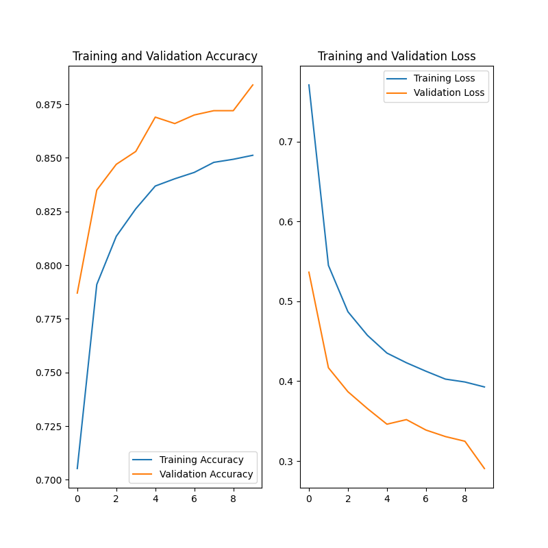

## MiniConvNet - A Fashion MNIST [1] Classifier

### Ideas
A first thought was to try out a simple fully connected two-layer network.
The first layer flattens the input image and connects it to a dense fully connected 256 neurons layer.
Which then is connected to a fully connected 10 neurons layer.   

After some experiments this network was clearly showing signs of overfitting and was not robust.
So, I tried a more sophisticated way.
The main structure is following AlexNet's [2] proposal.
The "MiniConvNet" network consists of three blocks, where the last two block are composed of two successive convolutions.
The convolution layers are initialized with random noise, to give the optimizer a better start.
A dropout layer is put after every block to counteract overfitting.
Additionally, I used data augmentation and different optimizers and compared the results in the table below.

### Experiments
The fully connected network reached a training accuracy of ~80% and testing accuracy of less than 50% after 10 epochs.
Clearly showing the signs of overfitting.
That's why I implemented a simple convolutional network called "MiniConvNet".
The following paragraphs shows results of different methods improving the accuracy, while reducing overfitting and still
having a maintainable number of trainable parameters.
"MiniConvNet" is a lightweight CNN and has 370'286 trainable weights.

| Training accuracy | Validation accuracy | Adam    | RMSprop | Data augmentation |
| :----------------:|:-------------------:|:-------:|:-------:|:-----------------:|
| 89%               | 91%                 | x       |         |                   |
| 85%               | 88%                 | x       |         | x                 |
| 90%               | 91%                 |         | x       |                   |
| 83%               | 86%                 |         | x       | x                 |

#### Loss function
For all the experiments a categorical cross-entropy loss function is used.
This loss is very well suited for multi class classification.

#### Data augmentation
The Training data is augmented to bring more variation into the data set.
The data is rotated, shifted horizontally and vertically and mirrored.  

#### Training Time, Memory, 
Due to the available GPU training time was within the range of five minutes or less.
The data set consisting of only 60'000 (28 x 28) images is relatively small.
The model size is roughly 1.5 MB. 

### Implementation
I really wanted to have a look at the new keras-tensorflow fusion library v.2.1.
I implemented a NN using simplified keras layers only for the first time.
The experiments were run on GPU on a GeForce GTX 960M graphics card.
It was really fun to see how straight forward one can build something meaningful.  

### Training Results

*Training history of "MiniConvNet" using the Adam optimizer without data augmentation over 10 epochs.*

*Training history of "MiniConvNet" using the Adam optimizer and data augmentation over 10 epochs.*

*Training history of "MiniConvNet" using the RMSprop optimizer without data augmentation over 10 epochs and a learning
 rate of 0.0005.*

*Training history of "MiniConvNet" using the RMSprop optimizer and data augmentation over 10 epochs and a learning rate
 rate of 0.0005.*

#### References
[1] https://github.com/zalandoresearch/fashion-mnist

[2] https://papers.nips.cc/paper/4824-imagenet-classification-with-deep-convolutional-neural-networks.pdf
